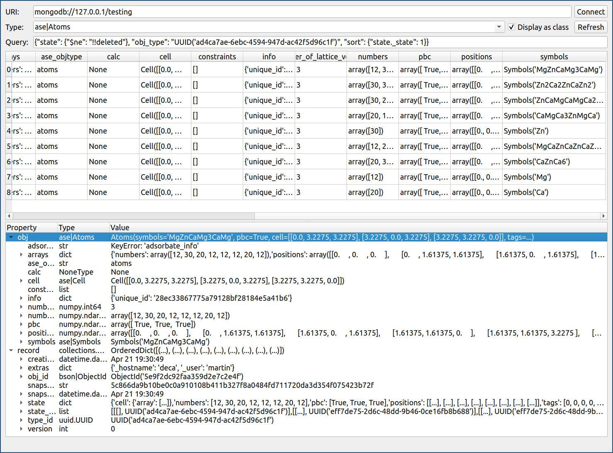

.. mincepy documentation master file, created by
   sphinx-quickstart on Fri Mar 31 17:03:20 2017.
   You can adapt this file completely to your liking, but it should at least
   contain the root `toctree` directive.

.. _mincePy: https://github.com/muhrin/mincepy
.. _object-document mapper: https://en.wikipedia.org/wiki/Object-relational_mapping#Object-oriented_databases
.. _data mapper pattern: https://en.wikipedia.org/wiki/Data_mapper_pattern
.. _python ORMs: https://en.wikipedia.org/wiki/List_of_object-relational_mapping_software#Python
.. _gui: https://github.com/muhrin/mincepy_gui/
.. _store: examples/quick-start.ipynb#Storing-objects
.. _find: examples/quick-start.ipynb#Finding-objects
.. _annotate: examples/quick-start.ipynb#Annotating-objects
.. _history: examples/quick-start.ipynb#Version-control
.. _Django: https://www.djangoproject.com/
.. _SQLAlehcmy: https://www.sqlalchemy.org/
.. _Storm: https://www.sqlalchemy.org/
.. _MongoEngine: http://mongoengine.org/
.. _identity map: examples/quick-start.ipynb#References

Welcome to mincePy's documentation!
===================================

.. image:: https://codecov.io/gh/muhrin/mincepy/branch/develop/graph/badge.svg
    :target: https://codecov.io/gh/muhrin/mincepy
    :alt: Coveralls

.. image:: https://travis-ci.org/muhrin/mincepy.svg
    :target: https://travis-ci.org/muhrin/mincepy
    :alt: Travis CI

.. image:: https://img.shields.io/pypi/v/mincepy.svg
    :target: https://pypi.python.org/pypi/mincepy/
    :alt: Latest Version

.. image:: https://img.shields.io/pypi/wheel/mincepy.svg
    :target: https://pypi.python.org/pypi/mincepy/

.. image:: https://img.shields.io/pypi/pyversions/mincepy.svg
    :target: https://pypi.python.org/pypi/mincepy/

.. image:: https://img.shields.io/pypi/l/mincepy.svg
    :target: https://pypi.python.org/pypi/mincepy/

`mincePy`_: move the database to one side and let your objects take centre stage.

MincePy is an `object-document mapper`_ (ODM) designed to make any of your Python object storable and queryable in a MongoDB database.
It is designed with  machine learning and big-data computational and experimental science applications in mind but is entirely general and can be useful to anyone looking to organise, share, or process large amounts data with as little change to their current workflow as possible.

Why was mincePy built?
++++++++++++++++++++++

For Python we already have `MongoEngine`_, `Django`_, `SQLAlehcmy`_, `Storm`_ and a bunch of `other <https://en.wikipedia.org/wiki/List_of_object-relational_mapping_software#Python>`_ great ORMs, so why do we need mincePy?
Well, in a typical ORM you subclass some kind of model class thus every object *is a* database object *plus* whatever else the object is designed to do.
This is great for applications where there is a tight coupling to the database but what if you can't or don't want to subclass from a model?
What if you want to store a numpy array, a PyTorch neural network configuration or any arbitrary Python object and have it be queryable?
This is where mincePy excels: You tell mincePy about the type you want to store and it takes care of the rest.

The other big thing that differentiates mincePy is version control.
Many of us are used to git and other VCS for code but what if we want to track changes to our data, made either by us a collaborator?
MincePy achieves this by keeping a snapshot of your object each time you save it so you can always retrieve an older version and see how it mutated over time.

Features
++++++++

* Ability to work locally or collaboratively on a shared database.
* Automatic tracking of in-memory objects (`identity map`_).
* Easy addition of new Python types.
* Object version control.
* Tracking of references between objects.
* Optimistic locking.
* Plugin system makes it easy to extend mincePy to support new types.
* Python 3.5+ compatible.
* A responsive, Qt, `gui`_:

Installation
++++++++++++

Installation with pip:

.. code-block:: shell

    pip install mincepy

Installation from git:

.. code-block:: shell

    # via pip
    pip install https://github.com/muhrin/mincepy/archive/master.zip

    # manually
    git clone https://github.com/muhrin/mincepy.git
    cd mincepy
    python setup.py install

Next you'll need MongoDB, in Ubuntu it's as simple as:

.. code-block:: shell

    apt install mongodb

see `here <https://docs.mongodb.com/manual/administration/install-community/>`_, for other platforms.

Table Of Contents
+++++++++++++++++

.. toctree::
   :glob:
   :maxdepth: 3

   examples/quick-start.ipynb
   examples/mapped-types.ipynb
   storing-objects
   development
   apidoc

Versioning
++++++++++

This software follows `Semantic Versioning`_

.. _Semantic Versioning: http://semver.org/
